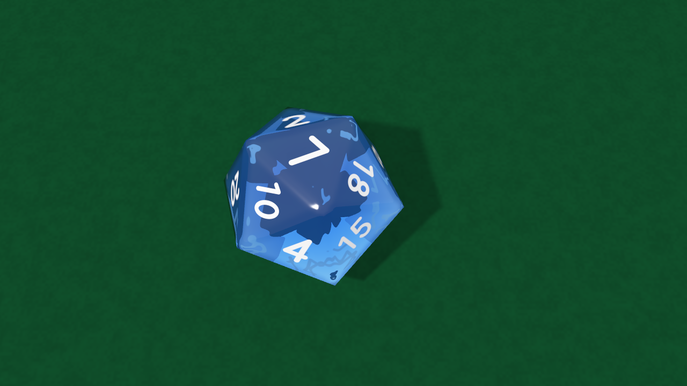

# dice

> **AI-assisted project.** This codebase was created with [Claude](https://claude.com/claude-code)
> (Anthropic), directed and reviewed by a human author. It has **never been
> loaded into Resolume**, on any platform, and it has never been built on
> Windows (see [Status](#status)). Everything below is measured by an offline
> harness that drives the real plugin classes in a headless GL context.
> `ditest --outcome` throws every value of every die, two hundred and twenty
> throws, and at rest the top face carries the value asked for every time;
> `--readback` then reads the number on top **out of the rendered pixels**, in the
> built-in face and in Georgia, and the wanted number beats every other number
> that die carries. `--silhouette` shows that turning a die by the symmetry that
> sets its result moves **at most one pixel** of its outline. `--duration` stops
> the last die at exactly Roll Time from 0.5 to 8 s, still moving a frame before.
> `ditest --negative` re-runs ten checks against deliberately wrong models, and
> `tools/mutate.sh` changes one character of the shipped shader and C++; every one
> is caught. A control sweep fails if any parameter does nothing.

Polyhedral dice for Resolume Arena/Avenue, as two FFGL plugins: **SW Dice**, a
source that throws a d4, d6, d8, d10, d12, d20 or d100 onto the table, and
**SW Dice Over**, an effect that throws them over your clip. Press **Roll**; the
dice tumble, bounce off the edges of the frame and each other, and come to rest
on a random result — or on the **Fixed Total** you set — at exactly **Roll Time**.

Eight throws, eight textures: marble d4s, engraved pips on d6s, pearl d8s,
a metal d100 pair in Georgia, stone d12s, gem d20s (the far faces' numbers seen
through the near ones), a wireframe d20 with nothing behind it, galaxy d10s on
the wooden table. Rendered by the plugin's offline harness (`ditest`), not
captured from Resolume.

## The one idea

**A die's rotation group lets the result be chosen without touching the
physics.** Every die in a set is face-transitive: for any two faces there is a
rotation of the solid onto itself that carries one to the other — twelve of them
for the d4, twenty-four for the d6 and d8, ten for the d10, sixty for the d12 and
d20. So the plugin:

1. **throws the dice honestly**, ahead of time: rigid bodies, gravity, an
   impulse at every contact, friction, restitution, from the edge of the frame
   to rest;
2. **reads which face the physics left on top** (on a d4, which vertex);
3. **draws each die as R(t)·S**, where S is the symmetry that carries the wanted
   face onto that one.

Because S maps the solid onto itself, every frame of the outline, every bounce,
every shadow is exactly what the physics produced; only the paint has turned.
The die lands on the number asked for and nothing in the motion gives it away.
Random results come from an integer PRNG (uniform by construction, not by
trusting a simulation to be fair), Fixed ones from you, and both go through the
same mechanism.

What falls out of it:

- **Any die, any result, any duration**, with a real tumble every time. The
  planner throws, measures how long the dice took to settle, and throws again
  harder or softer with a fresh sub-seed; playback then runs the throw at
  whatever rate makes the last die stop on Roll Time.
- **Several dice at once** (Count, up to six; six pairs for the d100), colliding
  with each other and the frame's edges. A Fixed result is a **total**, split
  across the dice uniformly over every combination that makes it.
- **The d100 as the real thing**: a tens die (00–90) and a units die (0–9)
  thrown together; 100 is 00 and 0.
- **A real set's numbering**: opposite faces sum to n + 1 (d6, d8, d12, d20) or 9
  (the d10's 0–9); the d6 has 1, 2, 3 counter-clockwise round a corner; the
  d8, d12 and d20 are balanced so no corner hoards the high numbers (the d20's
  corners are within 3% of the mean); the d4 prints each number three times, at
  its vertex, and is read at the top; 6 and 9 are marked on the dice that have
  both.
- **A cocked die is rerolled**, as at a table: a throw that leaves a die leaning
  on another or on a wall is thrown again. So is one that leaves dice jammed
  against the edge of the frame, for the first few tries.

## Controls

- **Roll:** Die (*D4 D6 D8 D10 D12 D20 D100*), Count (1–6), **Roll** (the
  button), Roll Time (0.4–8 s), Result (*Random*, *Fixed*), Fixed Total (the
  sum of the dice), Seed (the same seed replays the same sequence of throws),
  Auto Roll and Interval (1–60 s), Throw (*Left*, *Right*, *Bottom*, *Top*,
  *Drop* from above, *Any*), Spin, Bounce (the table's restitution, 0.1–0.8).
- **Dice:** Texture (*Plastic*, *Marble*, *Pearl*, *Metal*, *Gem* — refracts, and
  shows the far faces' numbers through the near ones — *Stone*, *Wood*,
  *Galaxy*, *Image* — the Texture File on every face — *Wireframe*, and on the
  effect *Clip*, the clip itself on every face), Texture File, Colour, Second
  Colour (marble's veins, stone's flecks, wood's grain, the galaxy's nebula),
  Gloss, Edge (how rounded the edges look), Line Width (Wireframe).
- **Numbers:** Font (*Built-in*, then every font installed on the machine),
  Font File (any .ttf/.otf/.ttc), Font Name (the family, as text — see below),
  Number Size, Weight, Ink, Number Style (*Painted*, *Engraved*), Mark 6 and 9
  (*None*, *Dot*, *Underline*), D6 Faces (*Numbers*, *Pips*).
- **Scene:** Size (the die as a fraction of the frame's height), Camera Angle
  (30° to straight down), Light Angle, Shadow, Table (*None* — transparent, only
  the shadows, so the layer goes over whatever is under it — *Felt*, *Wood*),
  Table Colour.
- **Over only:** Mix. The effect's Table *None* is the clip, with the dice's
  shadows on it.

**Fonts travel by name.** The Font dropdown stores an index into *this*
machine's font list, which is a different font on the next rig. The plugin keeps
the family in Font Name, a composition restores both, and the name wins; a font
the next machine lacks falls back to the built-in face with the name kept, so
the composition finds it again on a machine that has it.

## Status

**v0.1.0, 2026-10-04, local, unreleased, and honestly early.**

It has **never been loaded into Resolume** and **never been built on
Windows**. `oxbow probe` reads the bundles as a host does (`SW Dice` / `DI01` /
source, `SW Dice Over` / `DI02` / effect) and `oxbow selftest` renders 120
frames through each. No GitHub repo, no tag, not on the website, no user guide,
no browser demo, no OpenFX port, no presets. Built and measured on macOS (Apple
Silicon).

What is measured, on this machine:

| | |
| --- | --- |
| outcome | Fixed: every value of every die, **220 throws, all showed the value asked for**; 63 throws of 2, 4 and 6 dice, every total right; 84 Random throws of two dice, every die showed its draw |
| readback | the number on top **read out of the picture**, 7 dice × 2 faces (built-in, Georgia), 82 printings: the wanted number fits the ink best every time, and where it and any rival number of that die disagree about ink, the picture sides with it **81–92%** of the time |
| silhouette | a die drawn at R and at R·S, for the plan's S and up to twenty more symmetries, at 320×180 and 640×360: **at most 1** of 6,000–45,000 covered pixels differs |
| symmetry | groups of order 12, 24, 24, 10, 60, 60, closed, proper, carrying vertices onto vertices; every S a throw uses is in its group |
| labels | every value once; opposite faces sum to 7, 9, 9, 13, 21; the western d6; each d4 vertex printed on its three faces |
| uniform | Random's draws, chi-square at p = 0.001 for all seven dice (d100: 121 against 148 over 40,000 draws); a 2d6 Fixed 7 splits evenly over its six combinations |
| rest | 84 throws of 1, 3 and 6 dice: every die flat to 0.0000°, on the table to 10⁻⁹ m, still, inside the walls, no two overlapping (separating-axis test) |
| duration | Roll Time 0.5, 1, 2, 4, 8 s × four dice: the last die settles at Roll Time to 10⁻⁹ s and is still moving one frame before |
| physics | free flight is the exact parabola to **2.5×10⁻¹⁵ m** over 0.5 s; in 40,000 steps of hard throws no kept contact solve added kinetic energy; a flat drop rebounds at e = 0.209, 0.515, 0.818 for Bounce 0.2, 0.5, 0.8 (tolerance 0.026: one step's travel over the drop) |
| geometry | volume and inertia tensor of every solid against a million-point Monte Carlo of its planes, to 0.04–0.25% and 0.2–0.7% |
| fonts | the built-in strokes' field is the half-width on every centreline to 0.006 H; Georgia's ten digits fill 0.005–0.995 H; the name, dropdown, file and missing-font paths each resolve as described above |
| Over | the clip is **bit-exact** more than five die radii from any die, and Mix 0 is the clip, at 320×180 and 640×360 |
| determinism | the same seed and roll: identical keyframes, byte for byte |
| data | the shader's row constants and the C++ layout agree, read back through the GPU bit for bit |
| GL state | viewport, vertex array, array buffer, program, unit, framebuffer, blend, scissor, unpack alignment, clear colour, ten texture units, both plugins |
| negative controls | **10** deliberately wrong models, **all 10** detected |
| mutants | **6** one-character changes (two GLSL, four C++), **all 6** caught |
| dead controls | **43** parameters over both plugins, all live |

Render cost (`ditest --bench`, mid-throw, felt table and shadows, the median
frame on an Apple M-series GPU): one marble d20 **0.7 / 1.0 / 2.3 ms** at
720p / 1080p / 4K; six gem d20s **2.3 / 3.5 / 10.5 ms**; six d100 pairs (twelve
dice) **2.7 / 4.0 / 11.3 ms**. Planning a throw runs on a worker thread, so the
roll starts a frame or two after the press: **0.5 ms** for one die, **15 ms**
for six (worst 42), **65 ms** for twelve (worst 150), most of it rethrowing
cocked dice.

What is **not** verified, and is the honest limit of this release:

- **Never in Resolume.** Nothing here has met Arena's clock, its parameter
  restore order (which the Font Name logic is built to survive, unseen), or a
  real GPU other than this one. Windows has never been compiled.
- **Real dice are quick.** A 20 mm die thrown across a frame-sized table is
  still in 0.3–0.7 s however hard it is thrown. A Roll Time longer than that
  plays the throw in slow motion (2 s is about 0.3×), easing a little toward the
  end so the reveal lingers. That is how a tabletop close-up is filmed, but it
  is slow motion, not a longer throw.
- **The contact model is mine, not a library's**: vertices against planes,
  edges against edges, sequential impulses, a sleep test. It is checked for
  energy, restitution, free flight and the resting state, not against a
  measured die. The rolling damping (felt) is a constant chosen to look right.
- **The rest is snapped.** A die the sleep test leaves under 1° off flat is
  turned flat over its last 0.15 s; more than 1° is a cocked die and a rethrow.
- **A close-up with several dice** (Size high, Count high) can leave a die out
  of shot after the planner's tries; the walls are moved past the frame for a
  close-up, so they no longer hold the dice in.
- **Edge rounding is shading only.** The outline is the sharp polyhedron; Edge
  bends the normals near an edge so the light rounds it.
- The Gem is a single refraction to the far face and out, with the colour as
  Beer–Lambert transmission across the die; no caustics, no second bounce.
- "Mark 6 and 9", not "6/9 Mark": a slash would be a separator in Arena's OSC
  address for the parameter.

## Build

C++17 + GLSL 4.10, CMake, FFGL 2.1 (SDK vendored as a submodule). macOS builds
are universal (arm64 + x86_64); Windows needs GLEW via vcpkg.

    git clone --recursive https://github.com/stoatworks-labs/dice
    cmake -B build -DCMAKE_BUILD_TYPE=Release
    cmake --build build
    cmake --install build          # both bundles into Resolume's Extra Effects

## Building and testing

The offline harness renders the real plugin classes headlessly, planning each
throw on the render thread so every run is the same run:

    ./build/ditest --out /tmp/dice.png                    one throw to rest
    ./build/ditest --over --out /tmp/over.png             the effect, on a card
    ./build/ditest --set "Die=1" --set "Count=3" --set "Result=1" --set "Fixed Total=12"
    ./build/ditest --geometry       the solids against a Monte Carlo of their planes
    ./build/ditest --symmetry       the rotation groups, and every S a throw uses
    ./build/ditest --labels         a real set's numbering
    ./build/ditest --outcome        every value of every die, Fixed totals, Random
    ./build/ditest --readback       the number on top, read out of the pixels
    ./build/ditest --silhouette     R and R S cover the same pixels
    ./build/ditest --uniform        chi-square of Random's draws
    ./build/ditest --rest           flat, still, inside, apart
    ./build/ditest --duration       the last die stops at Roll Time
    ./build/ditest --physics        parabola, energy, restitution
    ./build/ditest --determinism --fonts --defaults --names --data
    ./build/ditest --over-check --state --resize
    ./build/ditest --negative       every check above against a wrong model
    ./build/ditest --offline        the no-GL subset and its negative controls (what CI runs)
    tools/mutate.sh                 one character changed, a check must fail
    python3 tools/sweep.py          no control is silently dead
    ./build/ditest --bench          720p through 4K, and the planner's cost
    tools/verify.sh                 all of it, in about a minute and a half

Filming uses the fleet's frame format and cue sheets (a press of Roll is three
cues, 0 1 0, or `--roll N`):

    ./build/ditest --film 300 --size 1280x720 --roll 10 --set "Table=1" \
      | ffmpeg -f rawvideo -pix_fmt rgba -s 1280x720 -r 60 -i - dice.mp4

<!-- attributions:start -->
This project is built on other people's work — see [ATTRIBUTIONS.md](ATTRIBUTIONS.md).
<!-- attributions:end -->

## Licence

MIT.

The dice are the Platonic solids and the pentagonal trapezohedron; the contact
solver is sequential impulses (Catto) with split-impulse position correction;
the uniform rotations are Shoemake's; the unbiased draw is Lemire's; the glyph
distance fields are stb_truetype's. Nothing is copied from anyone's source but
the vendored headers in `external/`.
