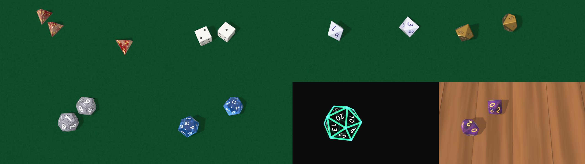

# Polyhedral user guide

Polyhedral is **polyhedral dice for [Resolume](https://resolume.com) Arena and Avenue**, as two
FFGL plugins: **SW Polyhedral**, a source that throws dice onto a table, and **SW Dice Over**, an
effect that throws them over your clip. Press **Roll**: the dice come in over the edge of the
frame, tumble, bounce off the frame's edges and each other, and come to rest on a random result
— or on the total you set — at exactly the Roll Time you set.


*A gem d20 come to rest on 7: the numbers on the faces beneath show through, mirrored.
Rendered by the plugin's offline harness, not captured from Resolume.*

> **Before you rely on this:** released at **v0.1.0**, and honestly early. What it does is
> measured rather than asserted, by a harness that drives the real plugin classes in a headless GL
> context. Every value of every die was thrown, 220 throws, and each time the value asked for came
> to rest on top; the harness then reads the number on top **out of the rendered picture**, in the
> built-in face and in an installed font, and gets it right every time. Turning a die by the
> symmetry that sets its result moves at most one pixel of its outline. The last die stops at
> exactly Roll Time from 0.5 to 8 seconds, and Random results pass a chi-square test for all seven
> dice. Ten deliberately wrong models are all detected, six one-character mutants of the shipped
> code are all caught, and all 43 controls across the two plugins measurably do something. It has
> **never been loaded into Resolume on macOS**. The one host it has run in on a Mac is the fleet's
> own test host, `oxbow`, for 120 frames through each plugin. Try it on a spare layer before you
> put it in a show.
>
> This codebase was created with AI assistance, directed and reviewed by a human author.

---

## Installing

Every download carries **both plugins**: the source and the effect. On macOS they are
`Polyhedral.bundle` and `Polyhedral Over.bundle`; on Windows, `Polyhedral.dll` and
`Polyhedral Over.dll`. Put both into Resolume's effects folder and restart Resolume:

```
macOS    ~/Documents/Resolume Arena/Extra Effects/
Windows  %USERPROFILE%\Documents\Resolume Arena\Extra Effects\
```

Avenue uses the same layout under its own folder name. **SW Polyhedral** then appears among the
sources and **SW Dice Over** among the effects. (The effect is not "SW Polyhedral Over" because
FFGL plugin names stop at 16 characters.)

The macOS download is a universal build (Apple silicon and Intel), as a `.dmg` or a `.zip`. It is
**Developer ID-signed and notarised**, so the bundles simply load. The Windows download is an x64
installer or a `.zip`. It is not code-signed, so the installer trips SmartScreen once: **More
info** → **Run anyway**.

---

## Two plugins

- **SW Polyhedral** (a source) throws the dice onto a table. With **Table** on *None* — the
  default — there is no table at all: only the dice and their shadows, on a transparent layer, so
  they land on whatever is underneath.
- **SW Dice Over** (an effect) throws them over the clip it is on. With Table on *None* the clip
  is the table, shadows and all. Its **Texture** list has one more entry, **Clip**, which puts the
  clip itself on every face of every die.

The effect declares every one of the source's controls and adds **Mix** at the end, after About.
A look built on one carries across to the other.

---

## How a result is chosen

Every die in a set has the same shape seen from every face: for any two faces there is a turn of
the die that carries one onto the other and leaves the die looking exactly as it did. Polyhedral
uses that. When you press Roll it throws the dice honestly, ahead of time — gravity, a knock at
every contact, friction, bounce — until they come to rest. It reads which face ended on top, and
then draws each die turned by the one rotation that puts **your** number where that face is.

The outline, every bounce and every shadow are the throw's own; only the numbers have moved round
the die. So a Fixed result looks exactly as random as a Random one, and a Random result is drawn
by the plugin (every face equally likely), not left to how the throw happened to go.

A die that comes to rest cocked — leaning on another die or against the edge — is thrown again
before you see anything, as at a table.

---

## Start here

1. Put **SW Polyhedral** on a layer above your content. You see a red marble d20 at rest.
2. Press **Roll** (map it to a key, a MIDI note or a Stream Deck button). The die is thrown in
   from an edge and lands on a random number at Roll Time, 1.2 seconds later.
3. Choose your **Die** and **Count**. A d20 for an attack, three d6 for damage, the d100 for
   percentile.
4. For a predetermined outcome set **Result** to *Fixed* and **Fixed Total** to the number. Press
   Roll: the dice land on it.
5. Pick a **Texture**, a **Colour**, and a **Font** from the fonts on your machine.

The roll starts a frame or two after the press: the throw is worked out on another thread first
(about half a millisecond for one die, a few tens of milliseconds for a dozen).

---

## The Roll group

- **Die** — *D4*, *D6*, *D8*, *D10*, *D12*, *D20*, *D100*. The d10 is numbered 0–9 and its 0
  reads as 10. The d100 is two dice, a tens die (00–90) and a units die (0–9), read together:
  37 is 30 and 7, and 100 is 00 and 0.
- **Count** — 1 to 6 dice (on the d100, 1 to 6 pairs).
- **Roll** — the button. A press while the dice are still rolling throws again.
- **Roll Time** — 0.4 to 8 seconds from release to rest, default 1.2. See *Real dice are quick*
  below.
- **Result** — *Random* (each die equally likely to show any face) or *Fixed*.
- **Fixed Total** — the total the dice show in *Fixed*, 1 to 600. Over several dice it is split
  across them, every combination that makes it equally likely (three d6 for 12 might come up
  4-4-4 or 6-5-1). A total the dice cannot make is clamped: two d6 cannot show 13, so they show 12.
- **Seed** — 0 to 9999. The same seed replays the same sequence of throws, roll by roll: load a
  composition and the first Roll does what it did last time.
- **Auto Roll** and **Interval** — throws by themselves, every 1 to 60 seconds (default 6).
  Switching Auto Roll on throws at once.
- **Throw** — where the dice come from: the *Left*, *Right*, *Bottom* or *Top* edge of the frame,
  *Drop* from above, or *Any* (a different one each roll).
- **Spin** — how fast they tumble as they leave the hand.
- **Bounce** — the table's springiness, 0.1 (felt) to 0.8 (hardwood), default 0.5.

### Real dice are quick

A real die thrown across a table this size is still in about half a second, however hard it is
thrown: most of its energy goes in the first few knocks. So a Roll Time longer than that plays the
throw in **slow motion** — 2 seconds is about a third of real speed — easing a little slower
towards the end so the result lingers. That is how a tabletop close-up is filmed anyway, but it is
slow motion, not a longer throw. Below about half a second the throw plays faster than real time.

---

## The Dice group



*Eight throws, eight textures: marble, engraved pips, pearl, metal in Georgia, stone, gem,
wireframe, and galaxy on the wooden table.*

- **Texture** — *Plastic*, *Marble* (veins of Second Colour), *Pearl* (a sheen that shifts with the
  angle), *Metal*, *Gem* (see-through: the light refracts, the colour deepens with thickness, and
  the numbers on the far faces show through, mirrored), *Stone* (flecks of Second Colour), *Wood*
  (grain in Second Colour), *Galaxy* (nebulae in Second Colour and stars), *Image* (the Texture
  File on every face), *Wireframe* (glowing edges, front bright and back dim, and the numbers on the
  faces turned towards you), and on the effect *Clip*.
- **Texture File** — a PNG, JPEG, BMP, TGA or GIF (its first frame), up to 4096 pixels on a side,
  for *Image*. Each face shows the picture centred on it.
- **Colour** and **Second Colour** — the body and the pattern. A gem's Colour is how much light
  gets through two inradii of it, so a pale colour makes a pale gem.
- **Gloss** — dull to polished.
- **Edge** — how rounded the edges look. (The outline stays sharp; the light rounds them.)
- **Line Width** — the wireframe's lines.

---

## The Numbers group

- **Font** — *Built-in* (stroked digits, the same on every machine) or any font installed on this
  one.
- **Font File** — any `.ttf`, `.otf`, `.ttc` or `.otc`, which beats the Font list.
- **Font Name** — the family in use, as text. You can also type a family into it.
- **Number Size** — how much of each face the number fills.
- **Weight** — thinner or bolder than the font draws it.
- **Ink** — the numbers' colour.
- **Number Style** — *Painted*, or *Engraved* (cut into the face, so the light catches one side of
  every stroke).
- **Mark 6 and 9** — *None*, a *Dot* after them, or an *Underline*, on the dice that have both
  (the d10, d12, d20 and the d100's units die).
- **D6 Faces** — *Numbers* or *Pips*.

**Fonts travel by name.** The Font list is this machine's fonts, so its *position* means a
different font on another computer. Polyhedral keeps the family's name in Font Name, a saved
composition stores both, and when they disagree the name wins. If the next machine does not have
the font, the numbers fall back to the built-in face and Font Name keeps the name, so the
composition finds the font again wherever it is installed.

Every die is numbered as a real set is: opposite faces add up to one more than the number of faces
(7 on a d6, 21 on a d20; 9 on the d10's 0–9); the d6 has 1, 2 and 3 meeting at a corner,
counter-clockwise; the d8, d12 and d20 are balanced so that no corner carries all the high numbers;
and the d4 prints each number three times, at its corner, so the number at the top of all three
visible faces is the roll.

---

## The Scene group

- **Size** — how big a die is, as a fraction of the frame's height. With several dice, the view
  widens as far as it must for all of them to land in shot, so six dice at a close-up Size come out
  smaller than asked. One die keeps any close-up.
- **Camera Angle** — 30 degrees (low across the table) to 90 (straight down). Default 70.
- **Light Angle** — where the light comes from, round the table.
- **Shadow** — how dark the shadows are; 0 removes them.
- **Table** — *None* (transparent: only the dice and their shadows), *Felt* or *Wood*.
- **Table Colour** — the felt or the wood.

The dice stay in the frame: its edges are the walls they bounce off. During a throw a die can still
cross an edge for a moment — they come in over it, and a die bouncing high towards the camera
looks bigger than the frame — but at rest every die is in shot.

---

## SW Dice Over

Everything above, over the clip. **Mix** fades between the clip alone (0) and the clip with the
dice (1). Where there is no die and no shadow, the clip comes through untouched, pixel for pixel.

**Texture: Clip** maps the clip onto every face, each face showing the middle of the picture. It is
the moving clip, so the dice carry it as they tumble.

---

## Time comes from the host

The dice move on the host's clock, so a paused composition freezes a throw mid-air. A step
backwards in the host's clock, or a jump forward of more than a quarter of a second (a clip trigger
or a scrub), passes no time: the throw carries on from where it was.

For the first few frames after it loads, the plugin runs on its own steady clock while it works out
whether the host counts time in seconds or milliseconds. Then it switches to the host's.

---

## Performance

Measured by the offline harness on an Apple M4 Max, mid-throw on a felt table with shadows, the
median frame, on a machine shared with other builds, so the spread is between runs:

| | 720p | 1080p | 4K |
| --- | --- | --- | --- |
| one marble d20 | 0.7–1.5 ms | 1.0–1.7 ms | 2.3–2.5 ms |
| six gem d20s | 1.8–2.3 ms | 3.5 ms | 8–10.5 ms |
| six d100 pairs (twelve dice) | 2.5–2.7 ms | 3.5–4.0 ms | 11.3–11.7 ms |

Working out a throw, on its own thread, takes about 0.5 ms for one die, 12 ms for six and 30 ms
for twelve, most of it throwing again the times a die comes to rest cocked.

Nothing was timed inside Resolume, and nothing was timed on Windows.

---

## If it looks wrong

**Nothing happens when I press Roll.** The roll starts a frame or two after the press, and lands
at Roll Time; at 8 seconds it is a slow throw. A paused composition freezes it.

**I see no table.** Table is *None*, the default: only the dice and their shadows are drawn, so the
layer goes over whatever is underneath. Choose *Felt* or *Wood*.

**The dice are smaller than Size says.** There are several of them, and the view has widened so
they all fit. Lower Count, or accept it.

**My font changed on another computer.** The font is not installed there; the numbers use the
built-in face, and Font Name still holds the name. Install the font, or choose another.

**The Image texture is grey.** The Texture File would not load (wrong format, or larger than 4096
on a side). The log says why.

**The dice are thrown slowly.** Roll Time is longer than a real throw takes, so the throw plays in
slow motion. Lower it towards a second for real speed.

**The effect does nothing at all.** A shader that will not compile looks exactly like that. The
real message is in the log:

```
macOS    ~/Library/Logs/polyhedral/polyhedral.YYYY-MM-DD.log
Windows  %LOCALAPPDATA%\polyhedral\logs\polyhedral.YYYY-MM-DD.log
```

It records the GL vendor, renderer and version at load, a shader that failed, the font in use (and
a named font that is not installed), a Texture File that would not load, and every roll: its
results, how many throws it took, and how much it was slowed.

---

## What is verified, and what is assumed

**Measured**, on an M4 Max under macOS, by the offline harness driving the real plugin classes:
every value of every die shown as asked; Fixed totals over several dice; Random draws shown as
drawn and uniform by chi-square; the number on top read out of the rendered pixels, in two fonts;
the symmetry moving no pixel of the outline, at two resolutions; the dice at rest flat, still,
inside the walls and apart; the last die stopping at Roll Time; free flight on the exact parabola,
no contact ever adding energy, and a drop rebounding at the Bounce asked for; the same seed giving
the same throw byte for byte; fonts by name, list, file and missing; the clip untouched by the
effect where it must be; and the GL state handed back to the host. Every check also runs against a
deliberately wrong model and must fail it, and a sweep fails if any control does nothing.

**Assumed, or not verified:**

- **Never loaded into Resolume on macOS**, and no Resolume has driven the controls on a Mac. How
  the groups present in the inspector, the clock's unit, and the order in which a composition
  restores Font and Font Name are untested there.
- **The physics is its own**, not a physics library's: corners and edges knocking on the table,
  the walls and each other. It is checked for energy, bounce, free flight and the resting state,
  not against film of real dice. The table's friction and the felt's rolling resistance are chosen
  to look right.
- **A die is laid exactly flat** over its last 0.15 seconds if it settles less than a degree off;
  more than that is a cocked die and a rethrow.
- **The rounded edges are shading**: the outline is the sharp solid.
- **The gem** is one refraction through the die and out, not a full light simulation.
- **The same seed gives the same results everywhere**, because they come from the plugin's own
  random numbers or from your total. The throw itself may differ between a Mac and a Windows
  machine: the two compile the arithmetic slightly differently.
- **The inspector shows slider positions.** Polyhedral does not supply its own display text, so
  expect the panel to show where each slider is rather than seconds or degrees. This guide gives
  the ranges.
- **Not timed in a host, or on Windows.** No OpenFX version.

---

## About

The last group in the source's panel, **About**, carries the plugin's name, version, licence and
maker, and buttons that open this guide, the project page, the source on GitHub and the support
page in your browser. In the effect, Mix follows it.

## Links

- Project page: [stoatworks-labs.com/software/polyhedral](https://stoatworks-labs.com/software/polyhedral/)
- Source: [github.com/stoatworks-labs/polyhedral](https://github.com/stoatworks-labs/polyhedral)

## Reporting something

[github.com/stoatworks-labs/polyhedral/issues](https://github.com/stoatworks-labs/polyhedral/issues).
A screenshot, the Die, Count and Texture, any controls you moved, whether it was the source or the
effect, and the composition's resolution and frame rate are usually enough.
